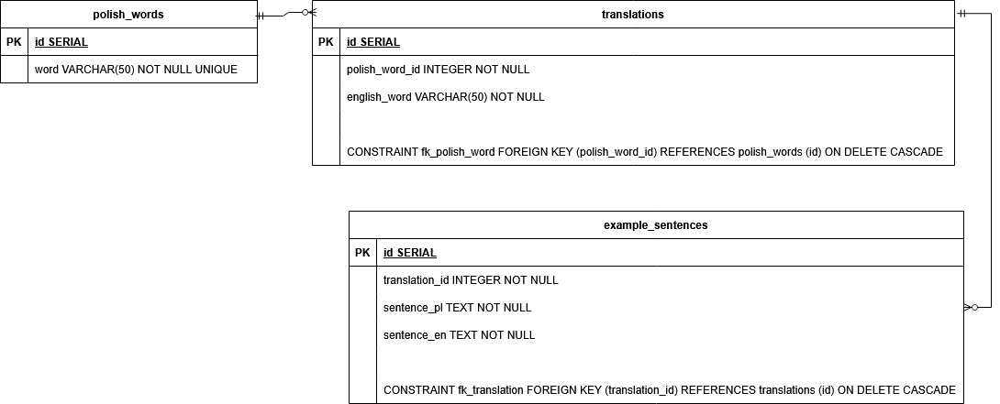

# GraphQL Dictionary API

System collecting translations of Polish words into English in a relational database with GraphQL API. The API allows end users to manage translations - create new ones, retrieve, modify and remove existing ones. A user is able to send a Polish word and its translation to English together with exemplary sentences presenting usage of the word. Multiple translations of a single word are possible.

# Technologies
- **Programming Language**: Go
- **GraphQL Framework**: gqlgen
- **Database**: PostgreSQL
- **Containerization**: Docker, Docker Compose

# Data Model


Additionally, version columns were added to every table to provide optimistic concurrency control.

# Installation

## Prerequisites
- **Go**
- **Docker and Docker Compose**

## Clone the repository

```bash
git clone https://github.com/grzegorzpapaj/graphql-dictionary-api.git
cd graphql-dictionary-api
```

## Configuration
Store all sensitive configuration in an .env file. Below is an example configuration:


```env
DB_HOST=localhost
DB_PORT=5432
DB_USER=postgres
DB_PASSWORD=password
DB_NAME=dictionary-db
PORT=8080
```

## Running the Application

```bash
docker-compose up -d
go run main.go
```

The API will be accessible at http://localhost:8080.

# GraphQL API Usage

The API exposes GraphQL endpoints for performing CRUD operations on database entries.

## Example Mutations and Queries

When running update queries, provide a version which is accessible by running a query beforehand. This ensures optimistic concurrency control.
Deletion is configured to CASCADE, meaning that when a record is deleted, all dependent records will also be removed.

### Polish Words
Adding a Polish word:

```graphql
mutation addPolishWordMutation{
  addPolishWord(polishWord: {
    word:"przykład"
    translations:[
      {
        englishWord: "example"
        exampleSentences: [
          {
            sentencePl: "To zdanie podane jest jako przykład."
            sentenceEn: "This sentence is given as an example."
          }
          {
            sentencePl: "To jest bardzo dobry przykład."
            sentenceEn: "It is a very good example."
          }
        ]
      }
    ]
  }) {
    id
    word
  	translations {
      id
      englishWord
      exampleSentences {
        id
        sentencePl
        sentenceEn
      }
    }
  }
}
```

Retrieving all Polish words:
```graphql
query retrieveAllPolishWordsQuery {
  polishWords {
    id
    word
    version
    translations {
      id
      englishWord
      version
      exampleSentences {
        id
        sentencePl
        sentenceEn
        version
      }
    }
  }
}
```

Retrieving single Polish word by word:
```graphql
query retrieveSinglePolishWordByWordQuery {
  polishWord(word:"przykład"){
    id
    word
    version
    translations {
      id
      englishWord
      version
      exampleSentences {
        id
        sentencePl
        sentenceEn
        version
      }
    }
  }
}
```
Alternatively, the user can retrieve a single Polish word by ID.


Updating a Polish word by word:
```graphql
mutation updatePolishWordByWordMutation {
  updatePolishWord(
    word: "przykład"
    edits: {
      version: 1
      translations: [
        {
          version: 1
          englishWord: "updated_example"
          exampleSentences: [
            {
              version: 1
              sentencePl: "Zaktualizowane zdanie PL"
              sentenceEn: "Updated sentence EN"
            }
          ]
        }
      ]
    }
  ) {
    id
    word
      	translations {
      id
      englishWord
      exampleSentences {
        id
        sentencePl
        sentenceEn
      }
    }
  }
}
```

Alternatively, the user can update Polish words by ID.

Deleting a Polish word:
```graphql
mutation deletePolishWordByWordMutation {
  deletePolishWord(word:"przykład") {
    id
    word
      translations {
        id
        englishWord
        exampleSentences {
          id
          sentencePl
          sentenceEn
      }
    }
  }
}
```

Alternatively, the user can delete Polish words by ID.


### Translations
Adding a translation by the word field of Polish word:
```graphql
mutation addTranslationByPolishwordWordMutation {
  addTranslation(
    polishWord: "przykład"
    translation: {
      englishWord: "AddedTranslation"
      exampleSentences: {
        sentencePl: "Przykładowe zdanie z AddedTranslation"
        sentenceEn: "Example sentence with AddedTranslation"
      }
    }
  ) {
    id
    englishWord
    exampleSentences {
      sentencePl
      sentenceEn
    }
    polishWord {
      id
      word
    }
  }
}
```

Alternatively, the user can add translations by ID field of Polish word.

Retrieving single translation by its ID:
```graphql
query retrieveSingleTranslationByIDQuery {
  translation(id:"2") {
    id
    englishWord
    exampleSentences {
      sentencePl
      sentenceEn
    }
    polishWord {
      id
      word
    }
  }
}
```

Updating translation by ID:
```graphql
mutation updateTranslationByIDMutation {
  updateTranslation(
    id:"2"
  	edits: {
      version: 1
      englishWord: "updatedExample"
      exampleSentences: [
        {
          version: 1
          sentencePl: "Przykładowe zdanie z tłumaczeniem updatedExample"
          sentenceEn: "Example sentence with translation updatedExample"
        }
      ]
    }
  ) {
    id
    englishWord
    version
    exampleSentences {
      sentencePl
      sentenceEn
      version
    }
    polishWord {
      id
      word
      version
    }
  }
}
```

Deleting translation by ID:
```graphql
mutation deleteTranslationByIDMutation {
  deleteTranslation(id:"2") {
    id
    englishWord
    exampleSentences {
      sentencePl
      sentenceEn
    }
    polishWord {
      id
      word
    }
  }
}
```

### Example Sentences

Adding an example sentence by translation ID:
```graphql
mutation addExampleSentenceMutation {
  addExampleSentence(
    translationId: "2"
    exampleSentence: {
      sentencePl: "Przykładowe zdanie PL"
      sentenceEn: "Example sentence EN"
    }
  ) {
    id
    sentencePl
    sentenceEn
    translation {
      id
      englishWord
      polishWord {
        id
        word
      }
    }
  }
}
```

Retrieving a single example sentence by its ID:
```graphql
query retrieveExampleSentenceByIDQuery {
  exampleSentence(id:"1") {
    id
    sentencePl
    sentenceEn
    translation {
      id
      englishWord
      polishWord {
        id
        word
      }
    }
  }
}
```

Retrieving all example sentences by ID field of their translation:
```graphql
query retrieveAllExampleSentencesByTranslationIDQuery {
  exampleSentences(translationId:"1") {
    id
    sentencePl
    sentenceEn
    translation {
      id
      englishWord
      polishWord {
        id
        word
      }
    }
  }
}
```

Updating an example sentence by its ID:
```graphql
mutation updateExampleSentenceByIDMutation {
  updateExampleSentence(
    id: "1"
    edits: {
      version: 1
      sentencePl: "Zaktualizowane zdanie PL"
      sentenceEn: "Updated sentence EN"
    }
  ) {
    id
    sentencePl
    sentenceEn
    translation {
      id
      englishWord
      polishWord {
        id
        word
      }
    }
  }
}
```

Deleting an example sentence by ID:
```graphql
mutation deleteExampleSentenceByIDMutation {
  deleteExampleSentence(id:"13"){
    id
    sentencePl
    sentenceEn
    translation {
      id
      englishWord
      polishWord {
        id
        word
      }
    }
  }
}
```